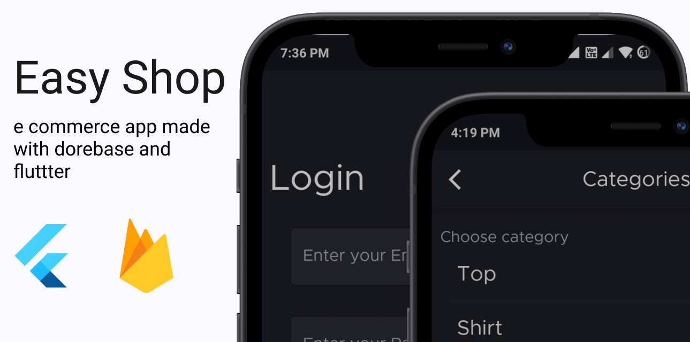

# Smart Shop 🛍️

A fully-functional e commerce app made in **Flutter** using **Firebase**.

# How To Run This Project 🏃‍♂️
1. Clone the repository.
2. Create project on firebase. 
3. Enable E-mail sign in.
4. Add some date data to your firebase. 
5. Add google.json file to project.
6. Do `flutter pub get`.

# Features 🚀
1. Sign in/Login.  
2. Add item to your wishlist.
3. Add item to your cart.
4. Sort product on the basis of different category.

# Built With 🛠
- [Flutter](https://flutter.dev/) - UI toolkit for building beautiful, natively compiled applications for mobile, web, desktop, and embedded devices from a single codebase.
- [firebase_auth](https://pub.dev/packages/firebase_auth) - A Flutter plugin to use the Firebase Authentication API.
- [firebase_core](https://pub.dev/packages/firebase_core) - Flutter plugin for Firebase Core, enabling connecting to multiple Firebase apps.
- [cloud_firestore](https://pub.dev/packages/cloud_firestore) - A Flutter plugin to use the Cloud Firestore API.
- [Get](https://pub.dev/packages/get) - Use for State management.
- [GetStorage](https://pub.dev/packages/get_storage) - A fast, extra light and synchronous key-value in memory, which backs up data to disk at each operation.

# Structure for app 🗼

    lib # Root Package

    ├── controllers                  #contain controllers
    |
    ├── models                       #contain data classes
    |   ├── bag_model                #shopping cart model      
    │   └── product_model            #product model
    |
    ├── repositories                 #single source of truth 
    |   └── cloud_functions          #contain all the cloud function 
    |
    ├── view                         #ui layer
    |    ├── pages                   #app screens 
    |    └── widgets                 #widgets
    |
    ├── utils                        #utility classes
    |                          
    └── main.dart                    #entry point

# Architecture for app 🏹
This app uses **Clean Architecture**.

.

# Platform Supported 💻📱

- [x] Android
- [x] IOS
